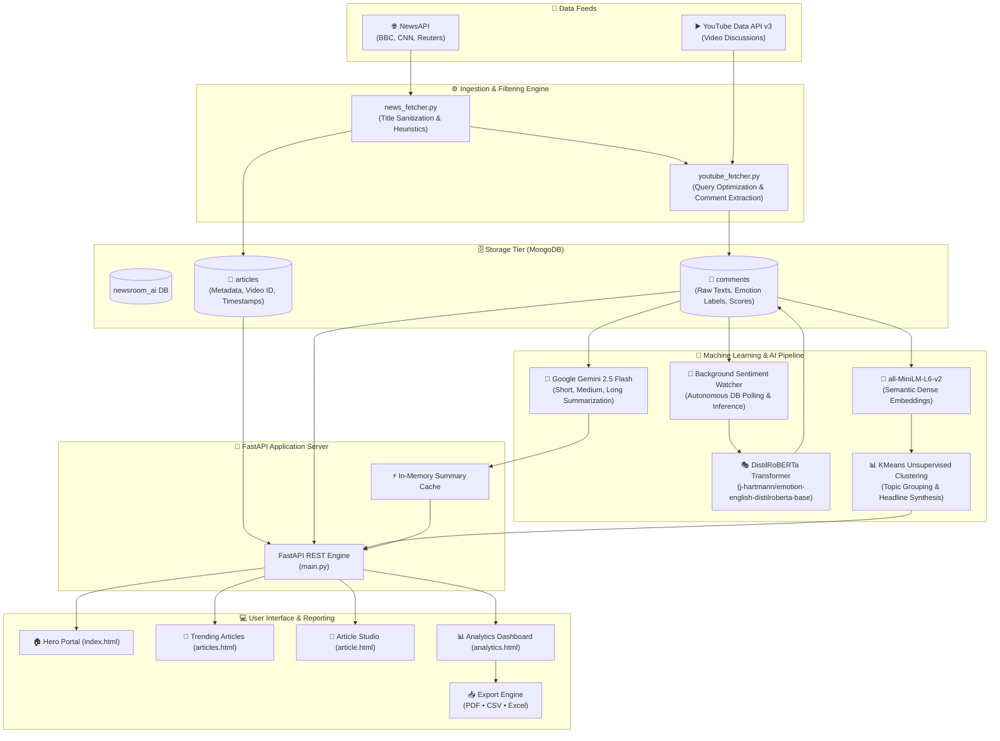

<div align="center">

# 📰 Newsroom AI
### Real-Time News Comment Intelligence, Emotion Mining & Multi-Horizon LLM Summarization

[](https://fastapi.tiangolo.com/)
[](https://www.python.org/)
[](https://pytorch.org/)
[](https://huggingface.co/)
[](https://ai.google.dev/)
[](https://www.mongodb.com/)
[](https://www.chartjs.org/)

<p align="center">
  <b>An end-to-end media intelligence engine bridging real-world breaking news, live video discourse, transformer-driven sentiment analysis, semantic topic clustering, and generative AI editorial synthesis.</b>
</p>

[Key Capabilities](#-key-capabilities) •
[End-to-End Architecture](#-end-to-end-architecture) •
[Deep Learning & ML Stack](#-deep-learning--ml-stack) •
[Quick Start & Setup](#-quick-start--setup) •
[REST API Reference](#-rest-api-reference) •
[Analytics & Reporting](#-analytics--reporting-suite) •
[Database Schemas](#-database-architecture)

---

</div>

## 🌟 Overview

In the era of hyper-fast news cycles, public opinion develops within minutes across digital platforms. **Newsroom AI** is an automated intelligence pipeline that tracks top breaking headlines from global press agencies (**BBC, CNN, Reuters**), discovers matching live broadcasts on **YouTube**, ingests audience discussion threads, and processes public sentiment using state-of-the-art Natural Language Processing models.

Through a unified, neon-dark cybernetic dashboard, newsrooms, journalists, and market researchers can immediately observe **emotional consensus**, uncover **divergent perspective clusters**, read **multi-length generative executive summaries**, and export audit-ready reports (**PDF, CSV, Excel**).

---

## ⚡ Key Capabilities

<table>
  <tr>
    <td width="50%">
      <h3>🌍 Automated Multi-Source Ingestion</h3>
      <ul>
        <li><b>Headlines Ingestion:</b> Filters breaking global news via NewsAPI.</li>
        <li><b>Noise Filtering:</b> Eliminates live blogs and low-information articles.</li>
        <li><b>YouTube Bridge:</b> Queries YouTube Data API v3 to correlate articles with verified video coverage and discussion threads.</li>
      </ul>
    </td>
    <td width="50%">
      <h3>🎭 Fine-Grained Emotion Mining</h3>
      <ul>
        <li>Powered by <b>DistilRoBERTa</b> fine-tuned on emotion classification.</li>
        <li>Identifies 7 granular emotional states: <i>Joy, Love, Anger, Sadness, Fear, Surprise, Neutral</i>.</li>
        <li>Continuous background MongoDB watcher with dynamic confidence scoring.</li>
      </ul>
    </td>
  </tr>
  <tr>
    <td width="50%">
      <h3>🧩 Semantic Clustering & Topic Discovery</h3>
      <ul>
        <li>Sentence-level embeddings via <code>all-MiniLM-L6-v2</code>.</li>
        <li>Unsupervised <b>K-Means Clustering</b> reveals diverging viewpoints.</li>
        <li>Automatic cluster headline synthesis highlighting key discourse themes and audience percentage distributions.</li>
      </ul>
    </td>
    <td width="50%">
      <h3>🧠 Multi-Horizon Generative Summaries</h3>
      <ul>
        <li>Powered by <b>Google Gemini 2.5 Flash</b> via the official <code>google-genai</code> SDK.</li>
        <li>Dynamic 3-tier editorial synthesis:
          <ul>
            <li><b>SHORT:</b> 2-3 sentence executive brief.</li>
            <li><b>MEDIUM:</b> 5-8 sentence structural recap.</li>
            <li><b>LONG:</b> Deep editorial analysis with themes & sentiment breakdown.</li>
          </ul>
        </li>
      </ul>
    </td>
  </tr>
</table>

---

## 🏛 End-to-End Architecture



---

## 🔬 Deep Learning & ML Stack

```text
┌─────────────────────────────────────────────────────────────────────────────┐
│                            AI / ML PIPELINE                                 │
├──────────────────────────┬──────────────────────────┬───────────────────────┤
│ TASK                     │ MODEL / ENGINE           │ LIBRARY / FRAMEWORK   │
├──────────────────────────┼──────────────────────────┼───────────────────────┤
│ Granular Emotion Mining  │ DistilRoBERTa-Base       │ PyTorch + Transformers│
│ Dense Vector Embeddings  │ all-MiniLM-L6-v2         │ Sentence-Transformers │
│ Unsupervised Clustering  │ K-Means (k=4)            │ Scikit-Learn + NumPy  │
│ Multi-Horizon Synthesis  │ Gemini 2.5 Flash         │ Google GenAI SDK      │
│ Real-Time Visualizations │ Interactive Charts       │ Chart.js              │
└──────────────────────────┴──────────────────────────┴───────────────────────┘
```

<details open>
<summary><b>1. Emotion Classification Pipeline (DistilRoBERTa)</b></summary>
<br>

- **Model:** `j-hartmann/emotion-english-distilroberta-base`
- **Output Labels:** `joy`, `love`, `anger`, `sadness`, `fear`, `surprise`, `neutral`.
- **Inference Strategy:** Runs as a dedicated background worker (`ML/sentiment.py`). Checks for unlabelled comments, batches inference with PyTorch `no_grad()`, applies softmax activation to logit outputs, and stores the winning class along with confidence probability into MongoDB.
</details>

<details open>
<summary><b>2. Semantic Clustering (Sentence-Transformers + KMeans)</b></summary>
<br>

- **Dense Embeddings:** `SentenceTransformer("all-MiniLM-L6-v2")` converts noisy comments into 384-dimensional dense vectors capturing contextual semantics.
- **Clustering:** `sklearn.cluster.KMeans` segments vector space into distinct opinion cohorts.
- **Dynamic Headline Generator:** Cleans URLs and non-alphanumeric noise, filters common stopwords, evaluates high-frequency distinctive n-grams, and titles the opinion cluster dynamically.
</details>

<details open>
<summary><b>3. Multi-Horizon Summarizer (Google Gemini 2.5 Flash)</b></summary>
<br>

- **Model:** `gemini-2.5-flash` via `google-genai`
- **Prompt Engineering:** Enforces strict multi-tier editorial schema:
  - `SHORT`: Executive overview (2-3 sentences).
  - `MEDIUM`: Structured consensus breakdown (5-8 sentences).
  - `LONG`: Complete thematic discourse evaluation with sentiment trends.
- **High-Throughput Caching:** Employs an in-memory application cache to minimize redundant API token consumption.
</details>

---

## 📂 Project Organization

```text
Newsroom-AI/
├── Backend/                     # FastAPI Core & Orchestration Engine
│   ├── __init__.py
│   ├── clustering.py            # Sentence-Transformers & KMeans logic
│   ├── db.py                    # MongoDB client & collection indexes
│   ├── main.py                  # API endpoints, background threads, Jinja2 routes
│   ├── news_fetcher.py          # NewsAPI integration & headline filtering
│   └── youtube_fetcher.py       # YouTube Data API v3 video search & comments
├── ML/                          # Machine Learning & Deep Learning Subsystems
│   ├── config.py                # Model configurations & database parameters
│   ├── sentiment.py             # DistilRoBERTa emotion classifier & watcher
│   └── summarizer.py            # Google Gemini 2.5 Flash LLM summarization
├── static/                      # Frontend Assets & Interactive Scripts
│   ├── css/
│   │   ├── analytics.css        # Dashboard styling, KPI cards & chart grids
│   │   ├── style.css            # Landing page layout & cyber themes
│   │   ├── style1.css           # Article catalog grid styles
│   │   └── style2.css           # Article view & comment stream styling
│   ├── images/                  # High-res newsroom graphic backdrops
│   └── js/
│       ├── analytics.js         # Chart.js rendering & PDF/Excel exporters
│       ├── app.js               # Landing page router
│       ├── app1.js              # Article card generator & fetcher
│       └── app2.js              # Comment interactions, clusters & summary UI
├── templates/                   # Semantic HTML5 Templates
│   ├── index.html               # Main entry hero page
│   ├── articles.html            # Article directory with live status
│   ├── article.html             # Studio: video, comments, clusters & summary
│   └── analytics.html           # Full-fledged intelligence dashboard
├── .gitignore                   # Version control exclusions
├── requirements.txt             # Environment dependencies & setup guide
└── README.md                    # Comprehensive documentation & system reference
```

---

## ⚡ Quick Start & Setup

### 1. Prerequisites

- **Python 3.11+** installed
- **MongoDB** running locally on default port `27017` or via MongoDB Atlas
- **API Keys**:
  - [Google Cloud Console](https://console.cloud.google.com/) — **YouTube Data API v3**
  - [NewsAPI.org](https://newsapi.org/) — **News API Key**
  - [Google AI Studio](https://aistudio.google.com/) — **Gemini API Key**

---

### 2. Clone the Repository

```bash
git clone https://github.com/Risshhhiiii/Comments-Sentiment-Analysis-And-Summarizer---Newsroom-AI.git Newsroom-AI
cd Newsroom-AI
```

---

### 3. Virtual Environment Setup

<details open>
<summary><b>Operating System Instructions</b></summary>

#### On Windows (PowerShell / Command Prompt):
```powershell
python -m venv venv
.\venv\Scripts\activate
```

#### On Linux / macOS:
```bash
python3 -m venv venv
source venv/bin/activate
```

</details>

---

### 4. Install Dependencies

```bash
pip install -r requirements.txt
```

---

### 5. Configure Environment Variables

Create a `.env` file in the project root:

```ini
# YouTube Data API v3 (For video comment extraction)
YOUTUBE_API_KEY=your_youtube_api_key_here

# News API (For breaking news headline discovery)
NEWS_API_KEY=your_news_api_key_here

# Google Gemini API (For multi-horizon AI summarization)
GEMINI_API_KEY=your_gemini_api_key_here

# Optional: MongoDB URI (defaults to mongodb://localhost:27017 if omitted)
MONGO_URI=mongodb://localhost:27017
```

---

### 6. Run the Application

Launch the server using Uvicorn:

```bash
uvicorn Backend.main:app --host 0.0.0.0 --port 8000 --reload
```

Open your browser and navigate to: **`http://localhost:8000`** 🚀

> **Note:** Upon startup, background threads will automatically begin fetching clean articles from NewsAPI, retrieving YouTube comments, loading the DistilRoBERTa model, and starting the emotion watcher.

---

## 📡 REST API Reference

All backend capabilities are exposed via RESTful endpoints:

<details open>
<summary><b>Core API Endpoints Table</b></summary>

| Method | Endpoint | Description | Query / Payload |
| :--- | :--- | :--- | :--- |
| `GET` | `/` | Web: Home landing page | None |
| `GET` | `/articles` | Web / JSON: Article listing (content negotiated) | None |
| `GET` | `/article` | Web: Individual article studio page | `?id=<article_id>` |
| `GET` | `/analytics` | Web: Visual intelligence analytics dashboard | None |
| `GET` | `/articles/{article_id}` | JSON: Article metadata & video details | `article_id` in path |
| `GET` | `/articles/{article_id}/comments` | JSON: Chronological comment stream | `article_id` in path |
| `POST`| `/articles/{article_id}/comments` | JSON: Manually post a comment | `{"text": "...", "username": "..."}` |
| `GET` | `/articles/{article_id}/clusters` | JSON: Semantic cluster headlines & percentage share | `article_id` in path |
| `GET` | `/articles/{article_id}/summary` | JSON: Multi-horizon Gemini summaries (Short/Med/Long) | `article_id` in path |
| `GET` | `/api/analytics/{article_id}` | JSON: Aggregated analytics, KPIs, distributions & trends | `article_id` in path |

</details>

---

## 📊 Analytics & Reporting Suite

The analytics dashboard (`/analytics`) transforms unstructured comment streams into structured intelligence:

```text
┌─────────────────────────────────────────────────────────────────────────────┐
│                        AI INTELLIGENCE DASHBOARD                            │
├─────────────────────────────────────────────────────────────────────────────┤
│  [Total Comments: 120]  [Dominant: Joy]  [Positive: 65%]  [Negative: 18%]   │
├──────────────────────────────────────┬──────────────────────────────────────┤
│ 🔵 DISCUSSION CLUSTERS (Pie)         │ 🟣 EMOTION BREAKDOWN (Polar/Bar)     │
│  - Economic Outlook   (42.5%)        │  - Joy: 38%       - Anger: 12%       │
│  - Policy Criticism   (31.2%)        │  - Love: 27%      - Sadness: 6%      │
│  - Future Impact      (26.3%)        │  - Surprise: 10%  - Neutral: 7%      │
├──────────────────────────────────────┴──────────────────────────────────────┤
│ 📈 SENTIMENT TRAJECTORY OVER TIME (Line Chart)                              │
│  Tracks cumulative negative sentiment ratio across the discussion lifecycle │
├─────────────────────────────────────────────────────────────────────────────┤
│ 🤖 AI EDITORIAL OPINION (Gemini 2.5 Flash)                                  │
│  Dynamic Short, Medium, and In-Depth Long Editorial Analysis                │
├─────────────────────────────────────────────────────────────────────────────┤
│ 📥 EXPORT CAPABILITIES: [📄 Export PDF]  [📊 Download CSV]  [📈 Excel (XLSX)]│
└─────────────────────────────────────────────────────────────────────────────┘
```

### Export Features:
- **PDF Report:** Rendered directly via `html2canvas` and `jsPDF`.
- **CSV Data:** Filtered export via `FileSaver.js` for data science pipelines.
- **Excel Workbook:** Structured spreadsheets via `SheetJS (xlsx)`.

---

## 🗄 Database Architecture

MongoDB hosts the `newsroom_ai` database with optimized compound indexes:

```text
newsroom_ai/
├── articles
│   ├── _id: ObjectId
│   ├── id: String (UUID, unique index)
│   ├── title: String (headline)
│   ├── summary: String (description)
│   ├── content: String
│   ├── url: String (original news link)
│   ├── source: "newsapi"
│   ├── video_id: String (YouTube video identifier)
│   └── published_at: ISODate
│
└── comments
    ├── _id: ObjectId
    ├── article_id: String (indexed for rapid query execution)
    ├── text: String (comment content)
    ├── source: "youtube" | "manual user: <username>"
    ├── emotion_label: "joy" | "anger" | "sadness" | "fear" | "love" | "surprise"
    ├── emotion_score: Float (confidence score, e.g. 0.9421)
    └── created_at: ISODate
```

---

## 🛠 Troubleshooting

<details>
<summary><b>1. YouTube API Quota Exceeded (<code>403 HttpError</code>)</b></summary>
The YouTube Data API v3 enforces a daily quota limit. The application optimizes search requests by executing single-result lookups with shortened headlines and fetching limited comment threads. If you exceed the quota, wait for daily reset or use an upgraded quota key.
</details>

<details>
<summary><b>2. Hugging Face Model Download</b></summary>
On initial startup, `ML/sentiment.py` downloads <code>j-hartmann/emotion-english-distilroberta-base</code> (~300MB). Ensure your environment has an active internet connection on first boot. The model will be cached locally for subsequent runs.
</details>

<details>
<summary><b>3. MongoDB Connection Refused</b></summary>
Ensure MongoDB is running locally on port <code>27017</code> or specify a remote Atlas URI in your <code>.env</code> file. To start MongoDB on Windows:
```powershell
net start MongoDB
```
</details>

---

## 🤝 Contributing

Contributions, feedback, and pull requests are welcomed!

1. **Fork** the Repository
2. **Create** your Feature Branch (`git checkout -b feature/EpicFeature`)
3. **Commit** your Changes (`git commit -m 'Add some EpicFeature'`)
4. **Push** to the Branch (`git push origin feature/EpicFeature`)
5. **Open** a Pull Request

---

## 📄 License

This project is open-source and distributed under the **MIT License**.

---

<div align="center">
  <sub>Engineered with precision for modern journalism and media intelligence. Authored and maintained by Rishi Sharma.</sub>
</div>
